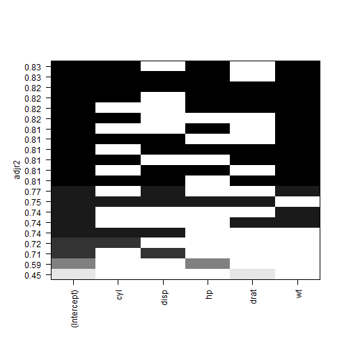
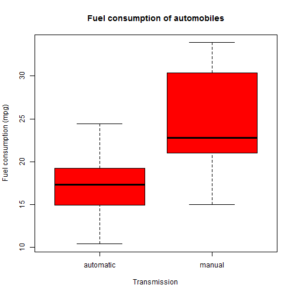
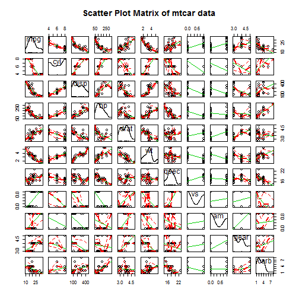
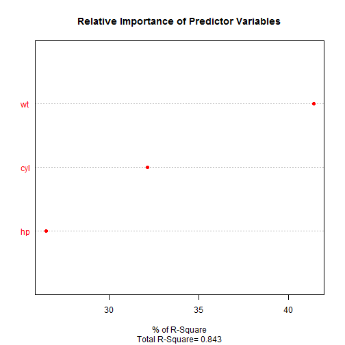
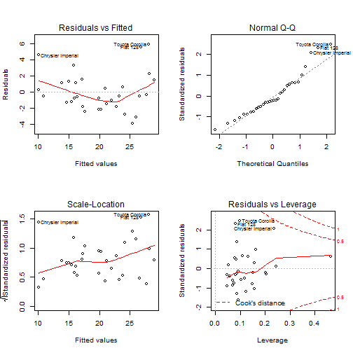

## Analysis of mtcars dataset and determine the relationship of variables and fuel consumption 

### Summary

1. Fuel consumption (mpg) of manual transmission cars is signficantly (alpha=0.05) higher than that of automatic transmission cars.

2. Fuel consumption (mpg) negatively correlates with number of cylinders (cyl), gross horsepower(hp) and weight (wt, lb/1000). A linear model with these three variables are sufficient in predicting mpg with an adjusted R-squared value of 0.8263. Weight is the most dominant predictor in this model.

### Analysis
Loading 'mtcars' data.

```r
data(mtcars)
d<-as.data.frame(mtcars)
```

I performed analysis on pair-wised variables in all of the variables in the mtcar data. As shown in Appendix 1.1, some variables have strong correlations with each other, these variables include cyl, disp, hp, drat, and wt.

Next, I used the 'leaps' library to determine which is the best model by fitting multiple models using a combination of these variables, and determine which one has the highest adjusted R-squared value with the minimal number of predictors.


```r
library(leaps)
leaps<-regsubsets(mpg ~ cyl+disp+hp+drat+wt, data=d, nbest=5)
plot(leaps, scale="adjr2")
```

 

As shown in the figure above, the model with intercept, cyl, hp, and wt has the highest adjusted R-squared value with the fewest predictors. 

A summary of intercept and coefficient this model is shown below:


```r
fit<- lm(mpg~ cyl+hp+wt, mtcars)
summary(fit)
```

```
## 
## Call:
## lm(formula = mpg ~ cyl + hp + wt, data = mtcars)
## 
## Residuals:
##     Min      1Q  Median      3Q     Max 
## -3.9290 -1.5598 -0.5311  1.1850  5.8986 
## 
## Coefficients:
##             Estimate Std. Error t value Pr(>|t|)    
## (Intercept) 38.75179    1.78686  21.687  < 2e-16 ***
## cyl         -0.94162    0.55092  -1.709 0.098480 .  
## hp          -0.01804    0.01188  -1.519 0.140015    
## wt          -3.16697    0.74058  -4.276 0.000199 ***
## ---
## Signif. codes:  0 '***' 0.001 '**' 0.01 '*' 0.05 '.' 0.1 ' ' 1
## 
## Residual standard error: 2.512 on 28 degrees of freedom
## Multiple R-squared:  0.8431,	Adjusted R-squared:  0.8263 
## F-statistic: 50.17 on 3 and 28 DF,  p-value: 2.184e-11
```

The adjusted R-squared value of this model is 0.8263. Coefficient for each predictor indicates changes in mpg change (in miles/(US) gallon) per 1 unit change in the each of the predictor. The 'wt' variable has the largest effect on fuel consumption, for each increase of (1000 lb), there is a decrease of ~3 miles/gallon in mpg. The weight of each variable in this model is detailed in Appendix 1.2. I also evaluated residuals and influences of the data and found minimal skewing of these parameters (Appendix 1.3).

**Is an automatic or manual transmission better for MPG?**

To address this question, I performed the following transformation of the data and plotted the mpg values against cars with different types of transmissions.


```r
d<-as.data.frame(mtcars)
d$trans[d$am==0]<-"automatic"
d$trans[d$am==1]<-"manual"
d$trans<-as.factor(as.character(d$trans))
boxplot(mpg~trans, data=d, col="red", xlab="Transmission", ylab="Fuel consumption (mpg)", main="Fuel consumption of automobiles")
```

 

The summary of mpg for cars with each type of transmission is shown below:


```r
library(plyr)
ddply(d, "trans", summarise, 
       N = length(mpg),
       min = min(mpg), 		
       median = median(mpg),		
       mean = mean(mpg),	       	
       max = max(mpg),
       sd   = sd(mpg),
       se   = sd / sqrt(N))
```

```
##       trans  N  min median     mean  max       sd        se
## 1 automatic 19 10.4   17.3 17.14737 24.4 3.833966 0.8795722
## 2    manual 13 15.0   22.8 24.39231 33.9 6.166504 1.7102804
```

The fuel consumption of manual transmission cars looks higher than that of automatic transmission cars.

**Quantify the MPG difference between automatic and manual transmissions.**

To determine if mpg of automatic and manual transmission cars are significantly different frome each other, I perform t.test.

```r
t.test(mpg ~ trans, data=d)
```

```
## 
## 	Welch Two Sample t-test
## 
## data:  mpg by trans
## t = -3.7671, df = 18.332, p-value = 0.001374
## alternative hypothesis: true difference in means is not equal to 0
## 95 percent confidence interval:
##  -11.280194  -3.209684
## sample estimates:
## mean in group automatic    mean in group manual 
##                17.14737                24.39231
```

Since the p-value is less than alpha (0.05), and with the 95% confidence interval not including zero, I rejected the null hypothesis and adapted the alternative: there is a true difference in mpg between the two groups.


### Appendix

**1.1. Scatter Plot Matrix of mtcars variables**

```r
library(car)
scatterplotMatrix(mtcars, spred=FALSE, smoother.args=list(lty=2), main="Scatter Plot Matrix of mtcar data")
```

 

**1.2. Relative weight of each variables in predicting mpg**

To establish the relative weight of each variable, I used the function ('relweight') below (From R in Action, by Robert I. Kabacoff, who adapted from Johnson JW (2000). A Heuristic Method for Estimating the Relative Weight of Predictor Variables in Multiple Regression, Multivariate Behavioral Research, 35, 1-19. 


```r
fit<- lm(mpg~ cyl+hp+wt, mtcars)

relweights <- function(fit,...){
  R <- cor(fit$model)
  nvar <- ncol(R)
  rxx <- R[2:nvar, 2:nvar]
  rxy <- R[2:nvar, 1]
  svd <- eigen(rxx)
  evec <- svd$vectors
  ev <- svd$values
  delta <- diag(sqrt(ev))
  lambda <- evec %*% delta %*% t(evec)
  lambdasq <- lambda ^ 2
  beta <- solve(lambda) %*% rxy
  rsquare <- colSums(beta ^ 2)
  rawwgt <- lambdasq %*% beta ^ 2
  import <- (rawwgt / rsquare) * 100
  import <- as.data.frame(import)
  row.names(import) <- names(fit$model[2:nvar])
  names(import) <- "Weights"
  import <- import[order(import),1, drop=FALSE]
  dotchart(import$Weights, labels=row.names(import),
           xlab="% of R-Square", pch=19,
           main="Relative Importance of Predictor Variables",
           sub=paste("Total R-Square=", round(rsquare, digits=3)),
           ...)
  return(import)
}
relweights(fit, col="red")
```

 

```
##      Weights
## hp  26.49678
## cyl 32.12595
## wt  41.37727
```

As shown above,'wt' accounts for ~41% of R-sqaured value. 

**1.3. Regression diagnostics of regression model**


```r
par(mfrow=c(2,2))
plot(fit)
```

 

The residuals vs fitted value plot, all the value are seem randomly distribute, suggestion there is no systematic relationship between the residuals and the fitted values. The Q-Q plot seem to indicate that the residuals are normalyly distributed. In addition, the points in the Scale-Loation are relatively random, suggest the absence of skewing in the variance of residuals. In the Residuals vs. Leverage graph, Chrysler Imperial, Toyota Corolla and Fiat 128 have the highest Cook's D values, hence, these values have more influence in this model.
 
To examine influence of each data point, I use:

```r
influence.measures(fit)
```

```
## Influence measures of
## 	 lm(formula = mpg ~ cyl + hp + wt, data = mtcars) :
## 
##                        dfb.1_   dfb.cyl   dfb.hp   dfb.wt   dffit cov.r
## Mazda RX4           -0.036697 -0.136162  0.11030  0.11607 -0.2128 1.152
## Mazda RX4 Wag       -0.012259 -0.056066  0.06052  0.03126 -0.1017 1.198
## Datsun 710          -0.362565  0.222505 -0.10666 -0.01440 -0.4083 0.980
## Hornet 4 Drive       0.000936  0.014692 -0.02792  0.00501  0.0443 1.215
## Hornet Sportabout   -0.084272  0.183145 -0.09258 -0.10880  0.2247 1.223
## Valiant              0.018970 -0.047730  0.15663 -0.09067 -0.2423 1.109
## Duster 360           0.010391 -0.013071 -0.10288  0.06863 -0.1822 1.263
## Merc 240D            0.043568 -0.060363 -0.02233  0.07975  0.1172 1.358
## Merc 230            -0.046684  0.069388 -0.01846 -0.05830 -0.0892 1.355
## Merc 280            -0.003256  0.000722  0.02775 -0.02956 -0.0702 1.196
## Merc 280C           -0.009148  0.002027  0.07797 -0.08306 -0.1973 1.081
## Merc 450SE          -0.090480  0.084195 -0.06569  0.01395  0.1576 1.203
## Merc 450SL          -0.066849  0.100724 -0.05607 -0.03687  0.1414 1.222
## Merc 450SLC          0.047944 -0.067579  0.03930  0.02074 -0.0977 1.240
## Cadillac Fleetwood   0.049482  0.030440  0.00147 -0.08972 -0.1088 1.439
## Lincoln Continental -0.024547 -0.022847  0.00492  0.05154  0.0605 1.527
## Chrysler Imperial   -0.431363 -0.560799  0.28264  1.00264  1.2295 0.776
## Fiat 128             0.592956 -0.140594 -0.13334 -0.05902  0.7600 0.538
## Honda Civic          0.161692  0.058795 -0.07510 -0.12857  0.2404 1.258
## Toyota Corolla       0.720932  0.030218 -0.15331 -0.37635  0.9146 0.478
## Toyota Corona       -0.455466  0.349145 -0.16801 -0.09369 -0.5382 0.849
## Dodge Challenger     0.148035 -0.292154  0.22139  0.11652 -0.3350 1.238
## AMC Javelin          0.189609 -0.404155  0.29336  0.18359 -0.4557 1.166
## Camaro Z28           0.022754  0.011802 -0.11266  0.02909 -0.1887 1.233
## Pontiac Firebird    -0.224815  0.298151 -0.20424 -0.06025  0.4300 0.954
## Fiat X1-9           -0.038447  0.001475  0.00771  0.01588 -0.0480 1.270
## Porsche 914-2       -0.065354  0.029903 -0.01653  0.01032 -0.0711 1.255
## Lotus Europa         0.372637 -0.095687  0.18758 -0.24463  0.4283 1.201
## Ford Pantera L      -0.012117 -0.009142 -0.08701  0.07577 -0.1379 1.440
## Ferrari Dino        -0.088782  0.035954 -0.10260  0.06962 -0.1654 1.180
## Maserati Bora        0.105292 -0.218383  0.51348 -0.11465  0.5646 2.042
## Volvo 142E          -0.326462  0.369857 -0.19240 -0.18612 -0.4535 1.070
##                       cook.d    hat inf
## Mazda RX4           0.011505 0.0750    
## Mazda RX4 Wag       0.002666 0.0582    
## Datsun 710          0.040546 0.0856    
## Hornet 4 Drive      0.000508 0.0533    
## Hornet Sportabout   0.012895 0.1098    
## Valiant             0.014798 0.0699    
## Duster 360          0.008527 0.1176    
## Merc 240D           0.003551 0.1574    
## Merc 230            0.002059 0.1520    
## Merc 280            0.001274 0.0469    
## Merc 280C           0.009809 0.0469    
## Merc 450SE          0.006373 0.0786    
## Merc 450SL          0.005142 0.0837    
## Merc 450SLC         0.002463 0.0817    
## Cadillac Fleetwood  0.003063 0.2016   *
## Lincoln Continental 0.000949 0.2437   *
## Chrysler Imperial   0.331631 0.2355   *
## Fiat 128            0.121033 0.0827   *
## Honda Civic         0.014771 0.1308    
## Toyota Corolla      0.169434 0.0996   *
## Toyota Corona       0.067879 0.0916    
## Dodge Challenger    0.028421 0.1492    
## AMC Javelin         0.051691 0.1565    
## Camaro Z28          0.009130 0.1034    
## Pontiac Firebird    0.044681 0.0858    
## Fiat X1-9           0.000597 0.0923    
## Porsche 914-2       0.001309 0.0860    
## Lotus Europa        0.045951 0.1617    
## Ford Pantera L      0.004913 0.2053   *
## Ferrari Dino        0.007001 0.0704    
## Maserati Bora       0.081526 0.4636   *
## Volvo 142E          0.050583 0.1237
```

('*') indicate data point with the most influence in this model.


